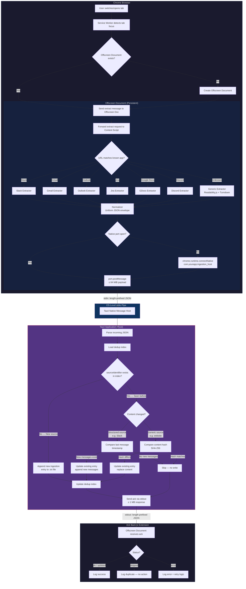

```
Chrome Extension (JS)              Tauri App (Rust)
─────────────────────              ────────────────
Detect tab focus                   Receive via Native Messaging
Route to extractor                 Check index for dedup
Extract DOM content                Decide: skip / update / new
Normalize to JSON                  Write .txt file
Send via Native Messaging          Update index
```

---

## Content managament
```
┌─────────────────────────────────────────────────────────┐
│                    Content Sources                      │
├─────────────────┬─────────────────┬─────────────────────┤
│  Native Apps    │  Electron Apps  │  Cloud Services     │
│  (Word, Excel)  │  (Teams, Slack) │  (Teams messages)   │
├─────────────────┼─────────────────┼─────────────────────┤
│  Accessibility  │  File-based     │  Graph API          │
│  API            │  extraction     │                     │
└─────────────────┴─────────────────┴─────────────────────┘

```

## Jira Extraction (Updated Feb 2026)

The Jira extractor uses a multi-strategy approach to handle Jira Cloud's React-based SPA:

### Extraction Strategies (in order of priority)

1. **REST API Extraction** (Primary - Most Reliable)
   - Extracts issue key from URL (`selectedIssue` param or `/browse/` path)
   - Calls `/rest/api/3/issue/{key}?expand=renderedFields,names`
   - Uses existing session cookies (`credentials: 'include'`)
   - Parses both rendered HTML and ADF (Atlassian Document Format)
   - Extracts: summary, status, priority, type, assignee, reporter, project, description, labels, comments

2. **DOM Extraction** (Fallback)
   - Uses MutationObserver to wait for React to render content
   - Multiple selector fallbacks for different Jira versions
   - Extended timeout (5s) for SPA content loading
   - Extracts from issue detail panel/modal

3. **Board View Extraction**
   - Detects board URLs (`/boards/`, `/board/`)
   - Extracts all visible cards with issue keys and summaries

4. **Backlog View Extraction**
   - Detects backlog URLs (`/backlog`)
   - Extracts backlog items

### Key Technical Details

- **URL Parsing**: Extracts issue key from `selectedIssue` query param (board view) or `/browse/PROJ-123` path
- **MutationObserver**: Watches for `data-testid`, `class`, and `id` attribute changes
- **ADF Parsing**: Recursively extracts text from Atlassian Document Format JSON
- **Session Auth**: REST API calls use browser's existing Jira session cookies

### Supported Jira Views

- Issue detail (full page)
- Issue detail (side panel/modal on board)
- Scrum/Kanban boards
- Backlog view
- Issue navigator/search results

---

## Google Docs Extraction (Updated Feb 2026)

Google Docs presents unique challenges due to its canvas-based rendering (introduced in 2021). The extractor uses multiple strategies:

### The Canvas Rendering Challenge

In 2021, Google Docs switched from DOM-based to canvas-based rendering for performance. This means:
- Text is drawn on a `<canvas>` element, not in DOM nodes
- Standard DOM queries return empty or incomplete content
- The accessibility layer (iframe) may have limited content
- Visual line breaks differ from semantic paragraph breaks

### Extraction Strategies (in order of reliability)

1. **Export URL** (Primary - Most Reliable)
   - Uses Google's built-in export: `/document/d/{DOC_ID}/export?format=txt`
   - Leverages user's existing session cookies
   - Returns complete document as plain text
   - Works regardless of rendering mode
   - Supported formats: `txt`, `pdf`, `docx`, `html`, `md`, `epub`

2. **DOM Extraction** (Fallback for older rendering)
   - Targets `.kix-page` and `.kix-lineview` elements
   - Works when DOM-based rendering is active
   - May return incomplete content with canvas rendering

3. **Iframe Extraction** (Accessibility layer)
   - Targets `.docs-texteventtarget-iframe`
   - Accesses `[contenteditable="true"]` within iframe
   - Limited by cross-origin restrictions

### Key Technical Details

- **Document ID Extraction**: Parses `/document/d/{DOC_ID}/` from URL
- **Content Cleaning**: Handles visual vs semantic line breaks
  - Double newlines = paragraph breaks (preserved)
  - Single newlines = visual wrapping (removed)
- **Title Detection**: Multiple fallbacks (`.docs-title-input`, page title)

### Google Docs URL Parameters Reference

```
/export?format=txt   - Plain text export
/export?format=pdf   - PDF export
/export?format=docx  - Word document
/export?format=html  - HTML export
/export?format=md    - Markdown export
/preview             - Preview mode (no editing)
/copy                - Create a copy
```

### Limitations

- Canvas-based rendering limits DOM extraction reliability
- Export URL requires user to be authenticated
- Some formatting (tables, images) lost in plain text export
- Real-time change detection not supported (use on tab focus)

---

## Google Sheets Extraction (Added Feb 2026)

Google Sheets extraction follows a similar pattern to Google Docs, using the export URL as the primary method.

### Extraction Strategies (in order of reliability)

1. **CSV Export URL** (Primary - Most Reliable)
   - Uses Google's built-in export: `/spreadsheets/d/{SPREADSHEET_ID}/export?format=csv&gid={SHEET_ID}`
   - Leverages user's existing session cookies
   - Returns the active sheet as CSV data
   - Works regardless of rendering mode
   - Supported formats: `csv`, `xlsx`, `pdf`, `ods`, `tsv`

2. **DOM Extraction** (Fallback)
   - Targets `.waffle-cell`, `[role="grid"]`, and cell elements
   - Works when DOM-based rendering is active
   - May return incomplete content with complex sheets

### Key Technical Details

- **Spreadsheet ID Extraction**: Parses `/spreadsheets/d/{SPREADSHEET_ID}/` from URL
- **Sheet GID**: Identifies which sheet tab to export (default: `0` for first sheet)
- **Title Detection**: Multiple fallbacks (`.docs-title-input`, page title)
- **URL Normalization**: Canonical form is `gsheets://{SPREADSHEET_ID}`

### Google Sheets URL Parameters Reference

```
/export?format=csv&gid=0   - CSV export of specific sheet
/export?format=xlsx        - Excel export (all sheets)
/export?format=pdf         - PDF export
/export?format=ods         - OpenDocument Spreadsheet
/export?format=tsv         - Tab-separated values
```

### Limitations

- Only exports one sheet at a time (the active sheet or specified GID)
- Formulas are exported as their computed values, not the formula text
- Charts and images are not included in CSV export
- Very large sheets may timeout or be truncated

---

## Google Slides Extraction (Added Feb 2026)

Google Slides extraction uses the same export URL pattern as Docs and Sheets.

### Extraction Strategies (in order of reliability)

1. **Text Export URL** (Primary - Most Reliable)
   - Uses Google's built-in export: `/presentation/d/{PRESENTATION_ID}/export?format=txt`
   - Leverages user's existing session cookies
   - Returns all slide text content as plain text
   - Includes speaker notes
   - Supported formats: `txt`, `pdf`, `pptx`, `odp`, `jpeg`, `png`, `svg`

2. **DOM Extraction** (Fallback)
   - Targets SVG text elements (`.punch-viewer-svgpage text`)
   - Extracts from filmstrip thumbnails
   - Extracts speaker notes if visible
   - Limited due to SVG-based rendering

### Key Technical Details

- **Presentation ID Extraction**: Parses `/presentation/d/{PRESENTATION_ID}/` from URL
- **Title Detection**: Multiple fallbacks (`.docs-title-input`, page title)
- **URL Normalization**: Canonical form is `gslides://{PRESENTATION_ID}`
- **Rate Limiting**: 5 second cooldown between exports (shared with Docs/Sheets)

### Google Slides URL Parameters Reference

```
/export?format=txt           - Plain text export (all slides)
/export?format=pdf           - PDF export
/export?format=pptx          - PowerPoint export
/export?format=odp           - OpenDocument Presentation
/export?format=jpeg&slide=id - JPEG of specific slide
/export?format=png&slide=id  - PNG of specific slide
/export?format=svg&slide=id  - SVG of specific slide
/embed                       - Embeddable view
/present                     - Presentation mode
```

### Limitations

- Images and charts are not included in text export
- Slide layout/formatting is lost in plain text
- Speaker notes are included but not clearly separated
- Very large presentations may timeout

---

## JSON Schema
```json
{
  "title": "BrowserCapturePayload",
  "type": "object",
  "required": ["source", "url", "content"],
  "properties": {
    "source": { "type": "string" },
    "url": { "type": "string", "format": "uri" },
    "content": { "type": "string" },
    "title": { "type": "string" },
    "author": { "type": "string" },
    "channel": { "type": "string" },
    "messageId": { "type": "string" },
    "threadId": { "type": "string" },
    "timestamp": { "type": "integer" }
  }
}
```

For messages:
```json
{
  source: "slack",
  url: "https://workspace.slack.com/archives/C123/p1234567890",
  content: "[john 10:30] Hey, did you see the PR?\n[jane 10:32] Yeah, looks good. Ship it.\n[john 10:33] Done!",
  threadId: "1234567890.000000",
  channel: "engineering"
}
```
3 required fields — source, url, content are the minimum needed to ingest anything

```sql
-- SQLite table: chunks
INSERT INTO chunks (id, vector_index, text, meta, is_deleted) VALUES (
    3,                          -- Auto-increment ID
    2,                          -- Index into vectors.bin (0-based)
    'Hey team, I''ve been looking at the authentication flow and I think 
     we should switch to JWT tokens instead of session cookies. The main 
     benefits are stateless verification and better mobile support. What 
     do you think?',
    '{
      "id": "a1b2c3d4-e5f6-7890-abcd-ef1234567890",
      "source": "slack",
      "timestamp": 1700000000,
      "header": "Hey team I ve been looking at the authentication flow and I think we should switch to JWT tokens instead of session cookies The main benefits are stateless verification and better mobile support What do you think",
      "chunk_idx": 0,
      "total_chunks": 1,
      "path": null,
      "ext": null,
      "file_size": null,
      "file_modified": null,
      "app_id": "msg-12345",
      "channel": "engineering",
      "author": "alice.smith",
      "url": null,
      "title": null,
      "score": null,
      "extra": null
    }',
    0                           -- is_deleted = false
);
```


## Project Structure
```

┌─────────────────────────────────────────────────────────────────┐
│                     Chrome Extension (MV3)                      │
│                                                                  │
│  tabs.onActivated / windows.onFocusChanged                      │
│         │                                                        │
│         ▼                                                        │
│  ┌─────────────┐    ┌──────────────────────────────────┐        │
│  │   Router     │───▶│  Extractors                      │        │
│  │ (URL match)  │    │  ├─ slack.js    (chat messages)  │        │
│  └─────────────┘    │  ├─ gmail.js    (inbox + emails)  │        │
│                      │  ├─ outlook.js  (inbox + emails)  │        │
│                      │  ├─ jira.js     (tickets/boards)  │        │
│                      │  ├─ gdocs.js   (document content) │        │
│                      │  ├─ gsheets.js (spreadsheet data) │        │
│                      │  ├─ gslides.js (presentation text)│        │
│                      │  ├─ discord.js  (chat messages)   │        │
│                      │  └─ generic.js  (readability.js)  │        │
│                      └──────────────┬───────────────────┘        │
│                                     │                            │
│                                     ▼                            │
│                          ┌──────────────────┐                    │
│                          │   Normalizer      │                    │
│                          │ (uniform JSON)    │                    │
│                          └────────┬─────────┘                    │
│                                   │                              │
│                                   ▼                              │
│.                      Native Messaging                          │
└──────────────────────────────┬──────────────────────────────────┘
                               │
                               ▼
┌──────────────────────────────────────────────────────────────────┐
│                        Tauri App (Rust)                           │
│                                                                   │
│  ┌─────────────────┐   ┌──────────────┐   ┌──────────────────┐  │
│  │ Native Message  │──▶│  Dedup Engine │──▶│  File Writer     │  │
│  │ Host            │   │              │   │                  │  │
│  └─────────────────┘   │ - Load index │   │ - Append new     │  │
│                         │ - Compare    │   │ - Update existing│  │
│                         │ - Decide     │   │ - Write index    │  │
│                         └──────────────┘   └──────────────────┘  │
└──────────────────────────────────────────────────────────────────┘

┌──────────────────────────────────────────────────────────────────┐
│                   Safari (Building Blocks Only)                   │
│                                                                   │
│  Safari Web Extension ──▶ XPC Service ──▶ Tauri App              │
│  (shares extractor code)  (Swift bridge)  (same Rust backend)    │
└──────────────────────────────────────────────────────────────────┘

```

### Communication:
The native message host becomes a thin relay. It receives small control messages from the extension ("hey, I have data ready, it's 3MB") and then the actual data transfer happens over a Unix domain socket between the native host and the Tauri app — two native processes talking to each other with zero restrictions.


## Flow
```
Chrome Extension
    │
    │  Native Messaging (stdin/stdout, 64 Mib limit)
    │  But only for small control messages
    ▼
Native Message Host (thin Rust binary)
    │
    │  Unix Domain Socket / Named Pipe (no size limit)
    │  Real IPC — no network, no ports
    ▼
Tauri App (main Rust process)
```



## The Three layers in the extension
1. Service Worker (background)
- Runs in its own isolated context, no DOM access at all
- Can listen for browser events (tab switches, installs, etc.)
- Can use Chrome extension APIs (chrome.tabs, chrome.runtime, etc.)
- Cannot see or touch any web page content
- Dies after ~30s of inactivity

2. Offscreen Document (background, persistent)

- A hidden HTML page, also no access to any tab's DOM
- Can hold the native messaging port open
- Can relay messages between the service worker and content scripts
- Think of it as a mailroom — it routes packages but never opens them

3. Content Script (runs inside each tab)
- This is the only context that can actually read the web page's DOM
- When you open Slack, the content script is injected into that Slack tab
- It shares the same DOM as the page — it can document.querySelector() to find messages, emails, etc.
- But it's sandboxed from the page's JavaScript (can't call Slack's JS functions, only read the DOM)
- It cannot use most Chrome extension APIs (no chrome.runtime.connectNative)

The content script is the only piece that can extract data, but it can't send that data to Tauri directly. It has to pass it back through the extension's internal messaging:\

```
Slack tab DOM
    │
    │  Content script reads DOM here
    │  (this is "running in the tab's context")
    ▼
Content Script ──chrome.runtime.sendMessage──▶ Service Worker / Offscreen Doc
                                                        │
                                                        │  port.postMessage
                                                        ▼
                                                   Tauri (Native Host)

```


## Step-by-Step Walkthrough

**1. User opens a new tab and navigates to `app.slack.com`**

Chrome loads the page. Because your extension's manifest declares content scripts should run on `<all_urls>`, Chrome automatically injects your content script (`content/index.js`) into the Slack tab. The content script is now alive inside that tab, sitting quietly, waiting for instructions. It does nothing on its own.

**2. Chrome fires `tabs.onActivated` event**

The moment that tab becomes the focused/active tab, Chrome's `tabs.onActivated` event fires. Your service worker wakes up to handle it. Remember — the service worker might have been asleep. Chrome spins it up specifically because there's an event it registered a listener for.

The service worker now has the `tabId` of the active tab. It calls `chrome.tabs.get(tabId)` to get the tab's URL: `https://app.slack.com/client/T.../C...`

**3. Service worker ensures the offscreen document exists**

Before doing anything with the extracted data, the service worker needs a way to send it to Tauri. That's the offscreen document's job. So it checks:

```
Does the offscreen document already exist?
├── Yes → move on to step 4
└── No → create it
     chrome.offscreen.createDocument({
       url: 'offscreen/offscreen.html',
       reasons: ['WORKERS'],
       justification: 'Native messaging bridge'
     })
```

If this is the first tab event since Chrome launched (or since the offscreen document was garbage collected), it creates the document. The offscreen document, on creation, immediately opens the native messaging port:

```
chrome.runtime.connectNative('com.yourapp.ingestion_host')
```

This tells Chrome: "Start the native host binary registered under that name." Chrome looks up the native messaging manifest file at `~/Library/Application Support/Google/Chrome/NativeMessagingHosts/com.yourapp.ingestion_host.json`, reads the `path` field, and spawns that binary (your Tauri app's ingestion host). A stdin/stdout pipe is now open between the offscreen document and the Tauri process.

If the offscreen document already existed, the native port is already open and connected. No work needed.

**4. Service worker tells the content script to extract**

The service worker sends a message to the content script running in the active tab:

```
chrome.tabs.sendMessage(tabId, {
  type: 'extract',
  url: 'https://app.slack.com/client/T.../C...'
})
```

This message travels through Chrome's internal messaging system from the service worker context to the content script context inside the Slack tab.

**5. Content script receives the extract command**

The content script in the Slack tab wakes up (it was listening via `chrome.runtime.onMessage`). It receives the message and looks at the URL to decide which extractor to use.

```
URL: app.slack.com → route to slack.js extractor
```

**6. Content script waits for DOM to settle**

This is a subtle but important step. The tab just became active — if the user switched back to a tab that was already loaded, the DOM is ready. But if they just navigated here, Slack might still be loading messages. The content script waits briefly (a short timeout or a MutationObserver watching for message containers to appear) to make sure the content is actually rendered.

**7. Slack extractor reads the DOM**

The Slack extractor runs inside the tab. It has full access to Slack's DOM. It does something like:

```
Find the channel name → #engineering
Find all visible message containers
For each message:
  - Extract author name
  - Extract timestamp
  - Extract message text
  - Extract any thread reply counts
  - Extract any reactions
```

It returns a structured object:

```json
{
  "source": "slack",
  "sourceIdentifier": "slack:#engineering",
  "title": "#engineering",
  "contentType": "chat",
  "content": {
    "messages": [
      {
        "author": "alice",
        "timestamp": "2026-02-06T10:15:00Z",
        "text": "Deployed v2.3 to staging"
      },
      {
        "author": "bob",
        "timestamp": "2026-02-06T12:45:00Z",
        "text": "Looks good, approving PR"
      }
    ]
  }
}
```

**8. Normalizer wraps it in the standard envelope**

Still inside the content script, the normalizer adds metadata:

```json
{
  "id": "a1b2c3d4-...",
  "source": "slack",
  "sourceIdentifier": "slack:#engineering",
  "url": "https://app.slack.com/client/T.../C...",
  "capturedAt": "2026-02-06T15:30:00Z",
  "lastUpdated": "2026-02-06T15:30:00Z",
  "contentType": "chat",
  "title": "#engineering",
  "content": { ... }
}
```

**9. Content script sends the normalized data back to the service worker**

The content script can't talk to the offscreen document directly. It sends the data back via:

```
chrome.runtime.sendMessage({
  type: 'ingestion-payload',
  data: { ...normalized JSON... }
})
```

This message goes to the service worker (which is still awake — it's been waiting for this response).

**10. Service worker forwards to the offscreen document**

The service worker receives the payload and relays it to the offscreen document:

```
chrome.runtime.sendMessage({
  type: 'send-to-native',
  data: { ...normalized JSON... }
})
```

The offscreen document is listening for these messages.

**11. Offscreen document sends the data over the native port**

The offscreen document receives the message and writes it to the native messaging port:

```
port.postMessage(data)
```

Chrome serializes this as length-prefixed JSON and writes it to the stdin of the Tauri native host process. The payload can be up to 64 MiB. For a Slack channel with visible messages, it's probably ~15KB.

**12. Tauri native host reads from stdin**

On the Rust side, the native host reads 4 bytes (message length), then reads that many bytes of JSON from stdin. It deserializes the JSON into a Rust struct.

**13. Tauri runs the dedup check**

The Tauri process loads its in-memory index (or has it already loaded if the process has been running). It looks up the `sourceIdentifier`: `slack:#engineering`.

```
Is "slack:#engineering" in the index?
├── No (first time seeing this channel)
│   → This is a new ingestion. Go to step 14a.
└── Yes (we've seen this channel before)
    → Compare content. Go to step 14b.
```

**14a. New source — append to file**

The Tauri process appends the full JSON entry to the ingestion `.txt` file. It adds an entry to the in-memory index:

```
"slack:#engineering" → {
  lastUpdated: "2026-02-06T15:30:00Z",
  lastMessageTimestamp: "2026-02-06T12:45:00Z",
  contentHash: "sha256:..."
}
```

Writes the updated index to disk. Moves to step 15.

**14b. Existing source — compare for changes**

Since this is Slack (structured source), the Tauri process compares the `lastMessageTimestamp` in the index against the timestamps in the incoming messages.

```
Index says last message was at 12:45:00Z
Incoming messages:
  - 10:15:00Z (alice) → already stored, skip
  - 12:45:00Z (bob)   → already stored, skip
  - 14:00:00Z (carol) → NEW, after last stored timestamp

New messages found? 
├── Yes → Update the existing entry in the .txt file
│         Append new messages to the content.messages array
│         Update lastUpdated and lastMessageTimestamp in index
└── No  → Skip. Don't touch the file.
```

**15. Tauri sends acknowledgment back**

The Tauri process writes a small JSON response to stdout:

```json
{ "status": "ok", "action": "created" }
// or
{ "status": "ok", "action": "updated", "newMessages": 1 }
// or
{ "status": "ok", "action": "skipped" }
```

This is length-prefixed JSON on stdout, under 1MB (it's ~50 bytes).

**16. Offscreen document receives the ack**

The offscreen document's `port.onMessage` listener fires with the response. It forwards it to the service worker:

```
chrome.runtime.sendMessage({
  type: 'native-response',
  data: { status: 'ok', action: 'created' }
})
```

**17. Service worker logs the result**

The service worker receives the ack. It can log it, update a badge on the extension icon, or just silently move on. Its job is done.

**18. Service worker goes to sleep**

No more events to handle. After ~30 seconds of inactivity, Chrome terminates the service worker. The offscreen document stays alive because it has an active native messaging port. The Tauri native host process stays alive because the stdin pipe is still open.

**19. User switches to another tab**

`tabs.onActivated` fires again. The service worker wakes up. Go back to step 2. The offscreen document and native port are still alive — no reconnection needed. Only the extraction and dedup cycle repeats.

---

That's the full lifecycle. Every tab switch is steps 2-17. The expensive setup (steps 3 and the native host spawn) only happens once per browser session.

Anything unclear, or ready to build?