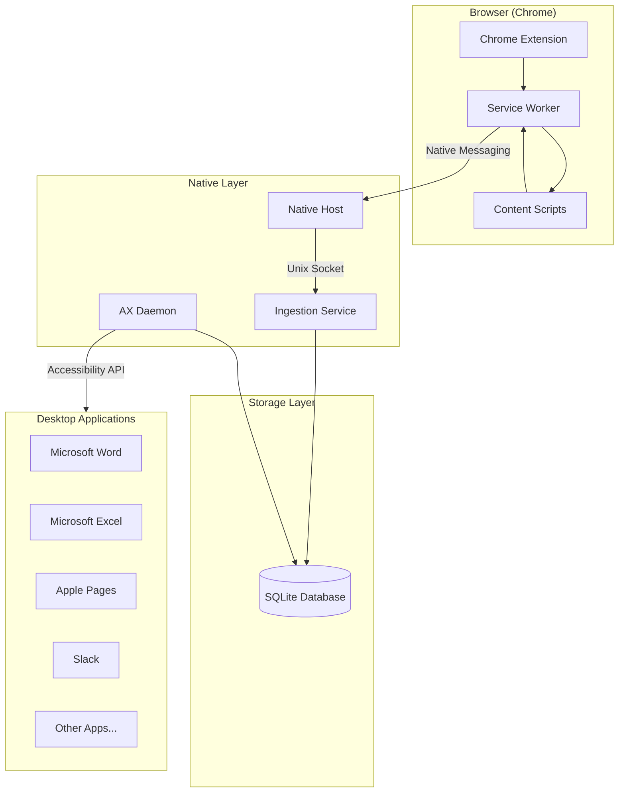
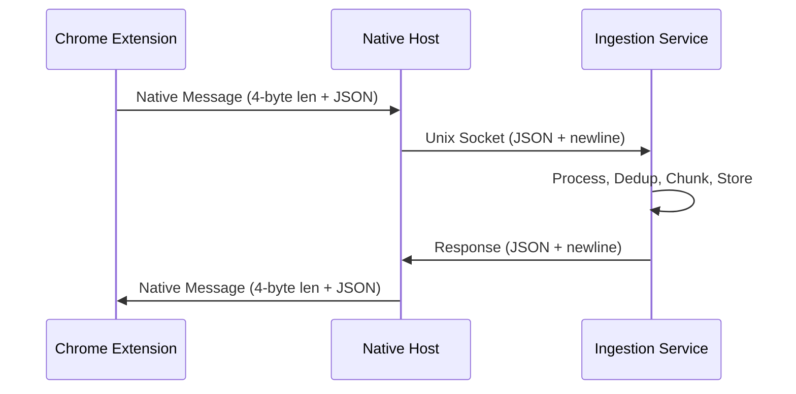
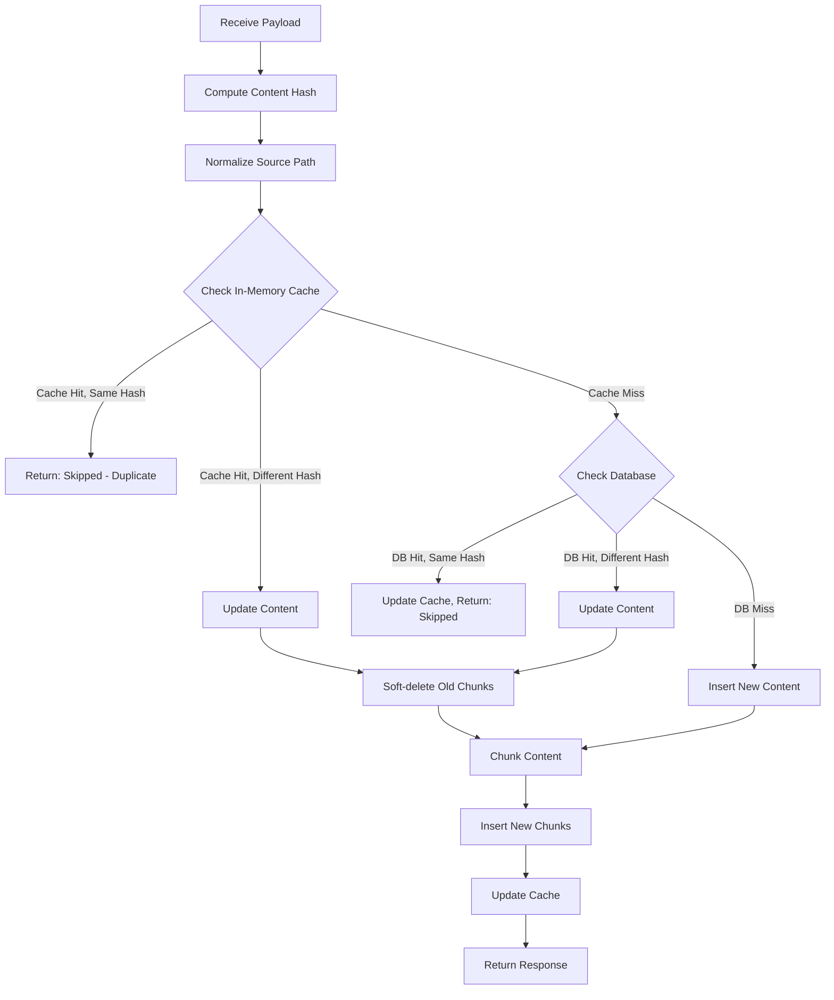
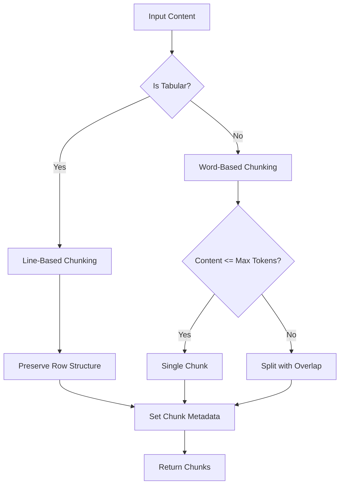
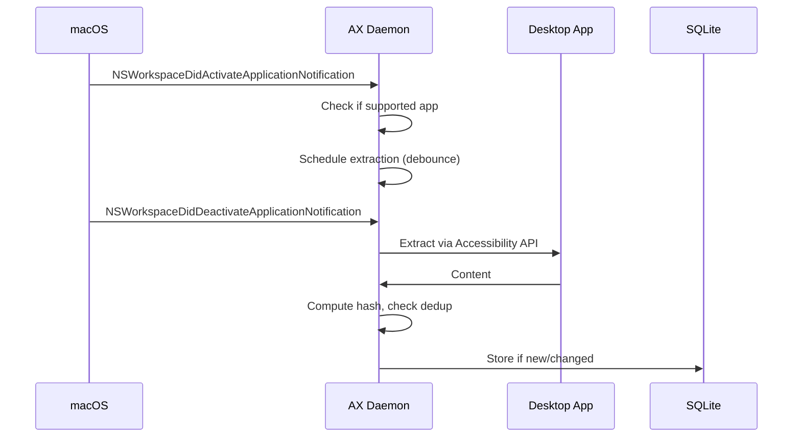
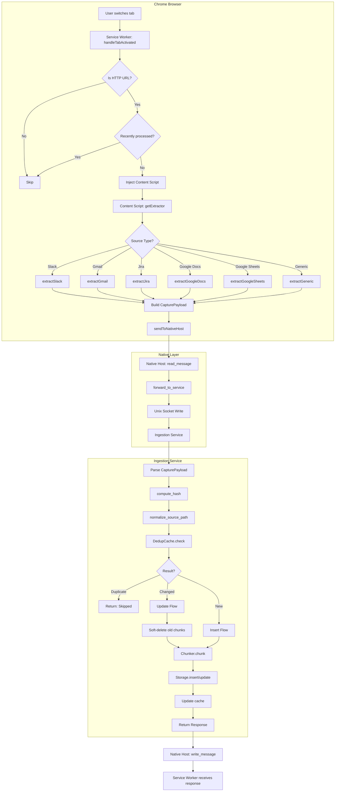
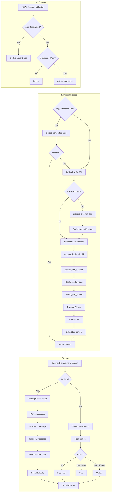
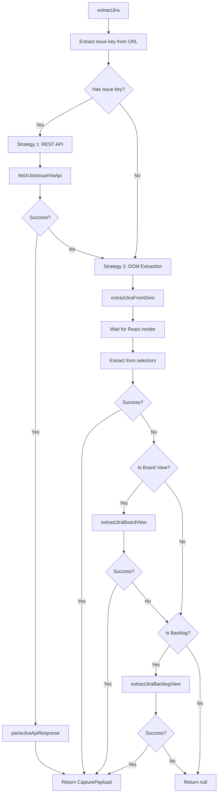
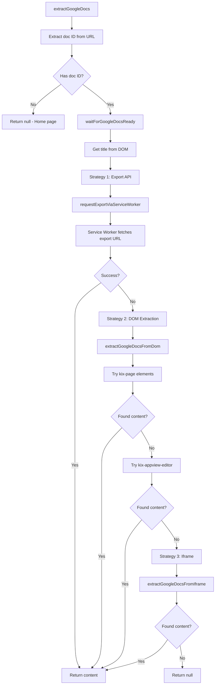

# Content Ingestion Pipeline - Technical Architecture Documentation

## Executive Summary

This project is a multi-component content ingestion system designed to capture, deduplicate, chunk, and store content from both web browsers and native desktop applications. The system enables a unified content repository for downstream processing (e.g., search, RAG, AI assistants).

The architecture consists of four main components:
1. **Chrome Extension** - Captures content from web pages
2. **Native Host** - Bridges Chrome extension to the ingestion service via native messaging
3. **Ingestion Service** - Processes, deduplicates, chunks, and stores content
4. **Accessibility Extractor** - Extracts content from native macOS applications

---

## System Architecture Overview



---

## Component Details

### 1. Chrome Extension

**Purpose:** Captures content from web pages when users switch tabs or navigate.

**Trigger Events:**
- Tab activation (user switches tabs)
- Window focus change
- URL change within same tab (SPA navigation)
- Page load complete

**Supported Sources:**
| Source | Identifier | Extraction Method |
|--------|------------|-------------------|
| Slack | `slack` | DOM parsing with message containers |
| Gmail | `gmail` | DOM parsing (inbox list or email body) |
| Outlook | `outlook` | DOM parsing with role-based selectors |
| Jira | `jira` | REST API + DOM fallback |
| Google Docs | `gdocs` | Export API via service worker |
| Google Sheets | `gsheets` | CSV export via service worker |
| Google Slides | `gslides` | Text export via service worker |
| Gemini | `gemini` | DOM parsing for conversations |
| Google AI Mode | `google-ai` | DOM parsing for AI responses |
| Discord | `discord` | DOM parsing |
| Generic | `browser` | Readability.js extraction |

**Rate Limiting:**
- Standard debounce: 1 second
- Google products debounce: 5 seconds
- Google export cooldown: 10 seconds between ANY Google export
- Rate limit penalty: 30 seconds after 429 response

### 2. Native Host (ingestion-host)

**Purpose:** Thin relay between Chrome extension and ingestion service.

**Communication Protocol:**
- **Input:** Chrome Native Messaging (stdin with 4-byte length prefix)
- **Output:** Chrome Native Messaging (stdout with 4-byte length prefix)
- **Backend:** Unix socket to ingestion service

**Socket Path:** `/tmp/clace-ingestion.sock`

**Message Flow:**


### 3. Ingestion Service

**Purpose:** Core processing engine for content ingestion.

**Key Modules:**
- `server.rs` - Unix socket server
- `payload.rs` - Data structures
- `dedup.rs` - Deduplication logic
- `chunker.rs` - Content chunking
- `storage.rs` - SQLite persistence

### 4. Accessibility Extractor

**Purpose:** Extract content from native macOS desktop applications using the Accessibility API.

**Binaries:**
- `ax-extractor` - CLI tool for manual extraction
- `ax-daemon` - Background daemon for automatic extraction

**Supported Applications:**
| Application | Bundle ID | Source |
|-------------|-----------|--------|
| Microsoft Word | `com.microsoft.Word` | `word` |
| Microsoft Excel | `com.microsoft.Excel` | `excel` |
| Microsoft PowerPoint | `com.microsoft.Powerpoint` | `powerpoint` |
| Apple Pages | `com.apple.iWork.Pages` | `pages` |
| Apple Numbers | `com.apple.iWork.Numbers` | `numbers` |
| Apple Keynote | `com.apple.iWork.Keynote` | `keynote` |
| Slack | `com.tinyspeck.slackmacgap` | `slack` |
| Discord | `com.hnc.Discord` | `discord` |

**Extraction Methods:**
1. **Direct File Extraction** - Parses document files directly (Word, Excel, Pages, etc.)
2. **Accessibility API** - Traverses AXUIElement tree for text content
3. **Electron-specific** - Enables accessibility for Electron apps (Slack, Discord)

---

## Data Schemas

### CapturePayload (Input Schema)

This is the unified payload format used by both the Chrome extension and accessibility extractor.

```json
{
  "source": "string",      // Required: "slack" | "gmail" | "jira" | "gdocs" | "word" | etc.
  "url": "string",         // Required: Location identifier (URL or accessibility:// path)
  "content": "string",     // Required: The text content to ingest
  "title": "string",       // Optional: Document title/subject
  "author": "string",      // Optional: Author/sender
  "channel": "string",     // Optional: Channel/project/workspace
  "timestamp": "number"    // Optional: Unix timestamp in seconds
}
```

**Source Values:**
| Source | Origin |
|--------|--------|
| `slack` | Slack (browser or desktop) |
| `gmail` | Gmail |
| `outlook` | Outlook |
| `jira` | Jira |
| `gdocs` | Google Docs |
| `gsheets` | Google Sheets |
| `gslides` | Google Slides |
| `gemini` | Google Gemini |
| `google-ai` | Google AI Mode |
| `discord` | Discord |
| `browser` | Generic web page |
| `word` | Microsoft Word (desktop) |
| `excel` | Microsoft Excel (desktop) |
| `powerpoint` | Microsoft PowerPoint (desktop) |
| `pages` | Apple Pages (desktop) |
| `numbers` | Apple Numbers (desktop) |
| `keynote` | Apple Keynote (desktop) |

### IngestionResponse (Output Schema)

```json
{
  "status": "ok" | "error",
  "action": "created" | "updated" | "skipped" | "failed",
  "ehl_doc_id": "string",   // Optional: UUID of the document
  "chunk_count": "number",  // Optional: Number of chunks created
  "message": "string"       // Optional: Error or skip reason
}
```

### ExtractedContent (Accessibility Extractor Internal)

```json
{
  "source": "string",           // Application source identifier
  "title": "string | null",     // Document title from window
  "content": "string",          // Extracted text content
  "app_name": "string",         // Full application name
  "timestamp": "number",        // Unix timestamp
  "extraction_method": "accessibility"
}
```

### ChunkMeta (Storage Schema)

```json
{
  "id": "string",           // ehl_doc_id (UUID)
  "source": "string",       // Source type
  "url": "string",          // Source URL/path
  "title": "string | null", // Document title
  "author": "string | null",
  "channel": "string | null",
  "chunk_index": "number",  // 0-based chunk index
  "total_chunks": "number", // Total chunks for document
  "source_type": "string"   // "capture" or "accessibility"
}
```

---

## Database Schema

### content_sources Table
Tracks ingested content sources for deduplication.

| Column | Type | Description |
|--------|------|-------------|
| id | INTEGER | Primary key |
| source_type | TEXT | Source identifier (slack, gmail, word, etc.) |
| source_path | TEXT | Normalized URL/path (UNIQUE) |
| content_hash | TEXT | SHA-256 hash of content |
| ehl_doc_id | TEXT | Document UUID (UNIQUE) |
| chunk_count | INTEGER | Number of chunks |
| ingestion_status | TEXT | Status (default: 'ingested') |
| created_at | TEXT | Creation timestamp |
| updated_at | TEXT | Last update timestamp |

### chunks Table
Stores actual content chunks.

| Column | Type | Description |
|--------|------|-------------|
| id | INTEGER | Primary key |
| vector_index | INTEGER | Index for vector search |
| text | TEXT | Chunk text content |
| meta | TEXT | JSON metadata (ChunkMeta) |
| is_deleted | INTEGER | Soft delete flag |
| created_at | TEXT | Creation timestamp |

### messages Table (Slack-specific)
Message-level deduplication for Slack.

| Column | Type | Description |
|--------|------|-------------|
| id | INTEGER | Primary key |
| source_url | TEXT | Slack channel URL |
| message_hash | TEXT | SHA-256 of message |
| message_text | TEXT | Message content |
| message_order | INTEGER | Time-based ordering |
| created_at | TEXT | Creation timestamp |

---

## Deduplication Logic

### Content-Level Deduplication (Default)



### Source Path Normalization

Different sources have their URLs normalized to canonical forms:

| Source | Raw URL | Normalized Path |
|--------|---------|-----------------|
| gdocs | `https://docs.google.com/document/d/ABC123/edit?...` | `gdocs://ABC123` |
| gsheets | `https://docs.google.com/spreadsheets/d/XYZ789/...` | `gsheets://XYZ789` |
| jira | `https://company.atlassian.net/browse/PROJ-123` | `jira://company.atlassian.net:PROJ-123` |
| slack | `https://workspace.slack.com/archives/C123/p456` | `slack://workspace.slack.com:/archives/C123/p456` |
| accessibility | N/A | `accessibility://Microsoft_Word/Document.docx` |

### Message-Level Deduplication (Slack)

For Slack, individual messages are tracked to enable incremental updates:

1. Parse messages from content (format: `[Author] [Time] Message`)
2. Compute hash for each message
3. Check which messages already exist in `messages` table
4. Insert only new messages
5. Rebuild chunks from ALL messages for the channel

---

## Chunking Strategy

### Configuration
- **Max Tokens:** 1024 words per chunk
- **Overlap:** 100 words between chunks

### Chunking Algorithm



### Tabular Detection
Content is considered tabular if:
- Multiple lines contain tab characters (`\t`)
- At least 2 of the first 10 lines have tabs

---

## Communication Protocols

### Chrome Native Messaging

**Message Format:**
```
[4-byte length (native endian)][JSON payload]
```

**Manifest Configuration:**
```json
{
  "name": "com.clace.extension",
  "description": "Clace content ingestion native messaging host",
  "path": "/path/to/ingestion-host",
  "type": "stdio",
  "allowed_origins": ["chrome-extension://EXTENSION_ID/"]
}
```

### Unix Socket Communication

**Protocol:** Newline-delimited JSON
- Request: `{JSON payload}\n`
- Response: `{JSON response}\n`

**Socket Path:** `/tmp/clace-ingestion.sock`

**Timeout:** 5 seconds for read/write operations

---

## AX Daemon Operation

The accessibility daemon monitors application switches and extracts content automatically.



**Debounce:** 2 seconds between extractions

---

## Dependencies & Libraries

### Accessibility Extractor (Rust)

| Crate | Version | Purpose |
|-------|---------|---------|
| `accessibility` | 0.2 | macOS Accessibility API bindings |
| `accessibility-sys` | 0.2 | Low-level AX bindings |
| `core-foundation` | 0.10 | Core Foundation types |
| `cocoa` | 0.26 | Cocoa framework bindings |
| `objc` | 0.2 | Objective-C runtime |
| `calamine` | 0.26 | Excel file parsing (xlsx, xls, xlsb, ods) |
| `docx-rs` | 0.4 | Word document parsing |
| `snap` | 1.1 | Snappy decompression (iWork files) |
| `rusqlite` | 0.31 | SQLite database |
| `sha2` | 0.10 | SHA-256 hashing |
| `uuid` | 1.0 | UUID generation |
| `serde` | 1.0 | Serialization |
| `chrono` | 0.4 | Date/time handling |
| `regex-lite` | 0.1 | Lightweight regex |

### Ingestion Service (Rust)

| Crate | Version | Purpose |
|-------|---------|---------|
| `tokio` | 1.0 | Async runtime |
| `rusqlite` | 0.31 | SQLite database |
| `sha2` | 0.10 | SHA-256 hashing |
| `uuid` | 1.0 | UUID generation |
| `serde` | 1.0 | Serialization |
| `regex` | 1.10 | URL normalization |
| `url` | 2.5 | URL parsing |
| `tracing` | 0.1 | Logging |

### Native Host (Rust)

| Crate | Version | Purpose |
|-------|---------|---------|
| `serde` | 1.0 | Serialization |
| `serde_json` | 1.0 | JSON handling |

### Chrome Extension (JavaScript)

| Library | Purpose |
|---------|---------|
| `Readability.js` | Generic web page content extraction |

---

## File Locations

### Database
- **Browser content:** `~/Library/Application Support/clace-ingestion/content.db`
- **AX Daemon:** Same location

### Unix Socket
- `/tmp/clace-ingestion.sock`

### Native Host Manifest
- `~/Library/Application Support/Google/Chrome/NativeMessagingHosts/com.clace.extension.json`

---

## Error Handling

### Extraction Errors

| Error | Description |
|-------|-------------|
| `PermissionDenied` | Accessibility permissions not granted |
| `AppNotFound` | Application not running or not found |
| `ElementNotFound` | No focused window or UI element |
| `NoContentFound` | Document is empty |
| `PatternNotSupported` | App doesn't support required accessibility patterns |
| `PlatformError` | macOS-specific API error |
| `Timeout` | Operation timed out |
| `AccessibilityError` | Failed to enable Electron accessibility |

### Response Status Codes

| Status | Action | Meaning |
|--------|--------|---------|
| `ok` | `created` | New content stored |
| `ok` | `updated` | Existing content updated |
| `ok` | `skipped` | Duplicate content, no action |
| `error` | `failed` | Processing failed |

---

## Migration Considerations

When migrating this system to another project, consider:

1. **Schema Compatibility:** The `content_sources` and `chunks` tables follow a specific schema. Ensure the target system can accommodate or adapt to this structure.

2. **Source Identifiers:** The `source` field values are hardcoded. Map these to the target system's taxonomy.

3. **URL Normalization:** The source path normalization logic is source-specific. Review and adapt for new sources.

4. **Deduplication Strategy:** The two-tier dedup (in-memory cache + database) may need adjustment based on scale requirements.

5. **Chunking Parameters:** The 1024-token max with 100-token overlap may need tuning for different embedding models.

6. **Platform Dependencies:** The accessibility extractor is macOS-only. Windows/Linux would require different APIs.

7. **Native Messaging:** The Chrome extension uses native messaging which requires platform-specific manifest installation.


---

## Detailed Flow Diagrams

### Browser Content Ingestion Flow



### Desktop Application Extraction Flow



### Jira Extraction Strategy



### Google Docs Extraction Strategy



---

## Security Considerations

1. **Accessibility Permissions:** The AX daemon requires explicit user consent via System Preferences.

2. **Native Messaging:** Only the specified Chrome extension ID can communicate with the native host.

3. **Local Storage:** All data is stored locally in SQLite; no cloud transmission.

4. **Credential Handling:** Google exports use existing browser session cookies (no stored credentials).

5. **Content Isolation:** Each source type has isolated extraction logic to prevent cross-contamination.

---

## Performance Characteristics

| Operation | Typical Latency | Notes |
|-----------|-----------------|-------|
| Tab switch extraction | 100-500ms | Depends on page complexity |
| Google export | 1-3s | Rate limited |
| Jira API extraction | 200-500ms | Depends on issue size |
| AX tree traversal | 50-200ms | Depends on app complexity |
| Dedup check (cache hit) | <1ms | In-memory |
| Dedup check (DB) | 1-5ms | SQLite indexed lookup |
| Chunking | 1-10ms | Depends on content size |
| SQLite insert | 5-20ms | With transaction |

---

## Testing Notes

The project includes property-based tests using `proptest` for:
- Serialization round-trips
- Bundle ID to source mapping
- Error message validation
- Content structure completeness

Test files are located in:
- `accessibility-extractor/tests/cli_tests.rs`
- `accessibility-extractor/src/types.rs` (inline tests)
- `ingestion-service/src/*.rs` (inline tests)
